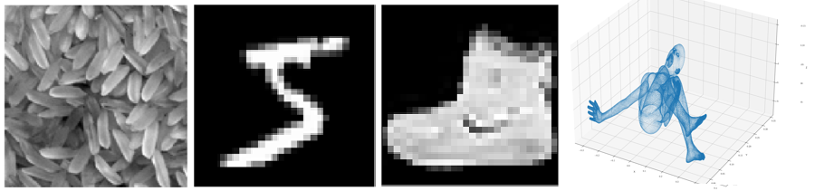

# TDA for image classification

## Overview

This project concerns the use of Topological Data Analysis (TDA) for classification of different types of images. I have merged and selected some approaches used in the papers reported in the bibliography below.
I implemented in Python the classification experiments on four different image datasets: a generic dataset of textures, [MNIST](Code/MNIST), [FMNIST](Code/FMNIST) and [SHREC14](Code/SHREC14). The first three reguards 2-d images, while the last one 3-d images.

I uploaded the experiments about the last three datasets, including a utils file for each of them. You can find the explanation of the experiments and the report of the results in the [presentation](Presentation). It is important to note how the topological information extraction method is enormously differentiated by the type of data used, and it is crucial for classification purposes. 

Due to memory reasons, I have not uploaded the SHREC14 dataset, that you can easily find online.

## Bibliography

- [A Topological Machine Learning Pipeline for Classification - University of Pisa - 2023 - Francesco Conti and others](https://arxiv.org/abs/2309.15276)
- [A Survey of Vectorization Methods in Topological Data Analysis - Spanish grants Ministerio de Ciencia e Innovacion – 2022 - Dashti Ali and others](https://arxiv.org/abs/2212.09703)
- [Adaptive template systems: data-driven feature selection for learning with persistence diagrams - Michigan State University – 2019 - Luis Polanco and others](https://arxiv.org/abs/1910.06741)
- [A Stable Multi-Scale Kernel for Topological Machine Learning“ - University of Salzburg - 2014 - Jan Reininghaus and others](https://arxiv.org/abs/1412.6821)
- [A Concise and Provably Informative Multi-Scale Signature Based on Heat Diffusion“ - Stanford University - 2009 - Jian Sun and others](https://www.lix.polytechnique.fr/~maks/papers/hks.pdf)

## Prerequisites

Python3 (I have tested it with Python3.9.6)
